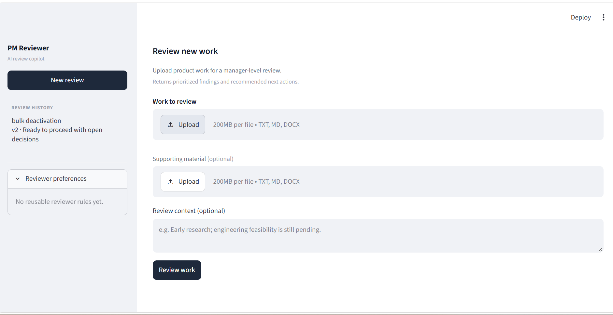
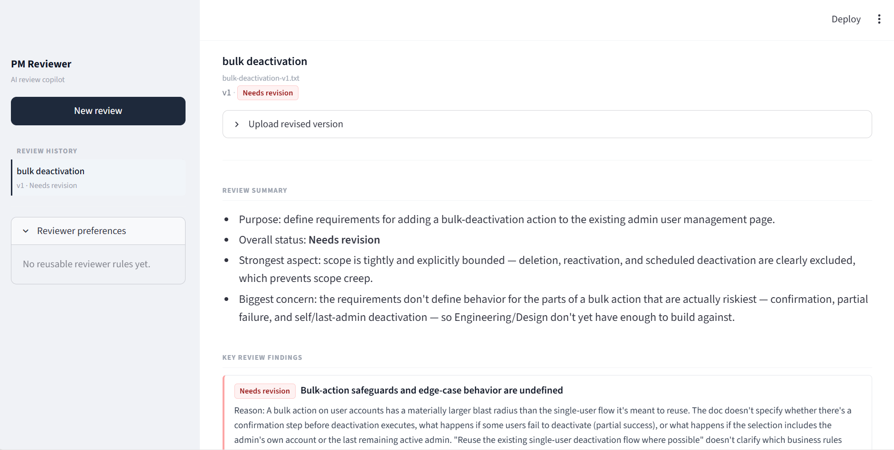
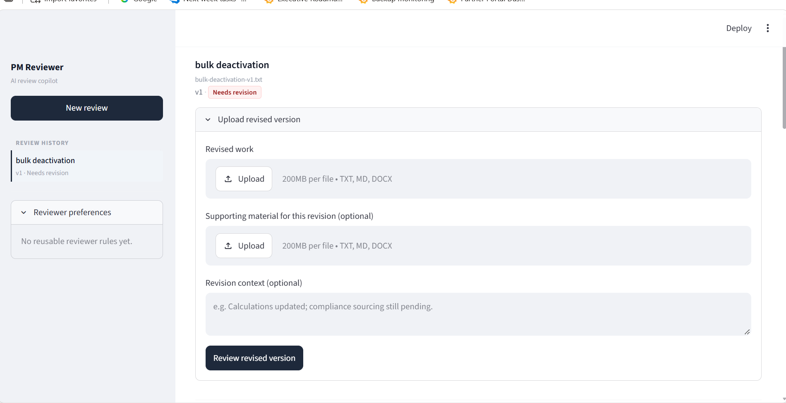
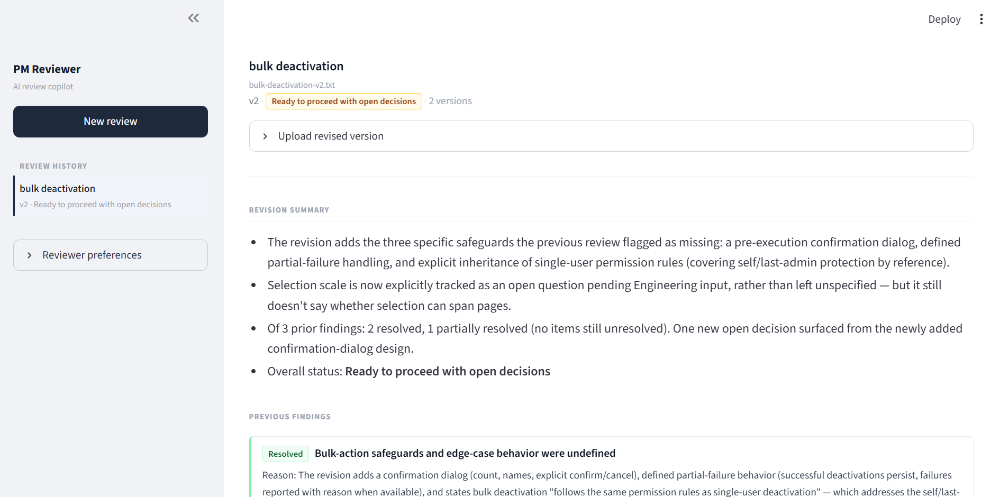

# PM Reviewer

PM Reviewer is an AI-assisted review copilot for product managers.

It is designed to reduce first-pass managerial review effort by reviewing work submitted by a product team, surfacing material issues, and tracking whether feedback has been addressed across revisions.

## The problem

Product managers spend significant time reviewing work such as:

- PRDs and requirements

- discovery and research

- product analyses

- feasibility notes

- customer-facing content

- rollout plans

- post-launch analyses

Generic AI review can become noisy by applying the same checklist to every document or asking for information that is not relevant at the current stage.

PM Reviewer instead reviews work based on what it is trying to accomplish and how mature the thinking is.

## What it does

- Reviews different types of PM work

- Infers purpose and maturity

- Decides whether to review, ask for clarification, or inspect supporting material

- Uses stage-appropriate review criteria

- Prioritizes findings as:

&#x20; - Needs revision

&#x20; - Open decision

&#x20; - Can defer

- Stores review history

- Supports reusable manager preferences

- Reviews revised versions of work

- Tracks previous feedback as:

&#x20; - Resolved

&#x20; - Partially resolved

&#x20; - Still unresolved

&#x20; - No longer relevant

- Identifies new issues introduced in later versions

## Product walkthrough

### 1. Start a managerial review

Upload the product work to review. Supporting material and review context are optional.

### 2. First-pass review

The reviewer interprets the work and surfaces only material issues. Findings are prioritized by what needs revision versus what can wait.

### 3. Submit a revised version

A revised document is added to the same review thread rather than starting a new review.

### 4. Track what changed

The reviewer compares Version 2 against the previous version and prior feedback, showing what was resolved, partially resolved, remains open, or is newly introduced.

## Review framework

The reviewer adapts five dimensions depending on the work:

1\. Problem \& Evidence

2\. Product Decision

3\. Experience \& Behaviour

4\. Execution \& Readiness

5\. Measurement \& Learning

Not every dimension is required for every piece of work.

## How it works

Work uploaded  

→ Interpret purpose and maturity  

→ REVIEW / ASK / READ SUPPORTING MATERIAL  

→ Adaptive managerial review  

→ Prioritized findings  

→ Review history and manager preferences  

→ Revision comparison for Version 2+

## Evaluation

The project includes 12 evaluation cases covering:

- strong and weak PRDs

- ambiguous proposals

- mixed customer evidence

- early-stage research

- external content

- feasibility work

- post-launch analysis

The latest evaluation run passed all 12 structural checks.

## Tech stack

- Python

- Streamlit

- SQLite

- python-docx

- Claude CLI

## Privacy

This portfolio version contains generalized code and synthetic examples only.

No employer documents, customer data, internal review history, credentials, or confidential product information are included.
